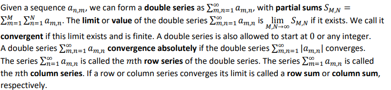

# Honors Math

## About

This is a summery of **Honors Calculus** (117 + 118) (or as some people call it: "**Abstract Calculus**")
This course will focus on set theory and number theory (and logic)

\* note this won't display properly on GitHub, I use a program called [Typora](https://typora.io/) with inline math enabled

## Index

0. [Shorthand](#0)
1. [Sets](#set)
2. [Logic](#logic)
3. [What is a number? (It's not what you think it is)](#number)
4. [Induction](#induction)
5. [Absolute values and Binomial Thm](#abs)
6. [Intervals and bounds](#inter)
7. [Real numbers](#real)
8. [Sequences and limits](#8)
9. [Functions (and notation)](#func)
10. [Continuity](#10)
11. [Inverse functions](#11)
12. [1-sided limits](#12)
13. [Intermediate value theorem (IVT)](#ivt)
14. [Differentiation](#diff)
15. [Extrema](#ext)
16. [Rolle's theorem](#roll)
17. [Mean value theorem (MVT aka Meme value theorem)](#MVT)
18. [First and second derivative test](#der)
19. [L'Hopital's Rule (Le hospital)](#hos)
20. [Convex and concave](#con)
21. [Exponentials and logs](#log)
22. [Logarithmic differentiation](#logd)
23. [Series](#ser)
24. [Geometric Series](#geo)
25. [Ratio, Root and Compression Tests](#tests)
26. [Dirichlet's and Leibniz Rule](#rich)
27. [Rearranging Series](#rearr)
28. [Double Seq.](#dseq)
29. [Power Series](#power)
30. [Taylor Series](#taylor)
31. [Integration](#integra)
32. [The Riemann Integral](#rie)
33. [Misc Notes](#misc)
34. [Resources](#end)

## Notes

#### 0. Shorthand

Ex. $\to$ example

Thm $\to$ Theorem (will be in block quotes)

Def $\to$ definition

s.t. $\to$ such that

, or ; or : $\to$ such that, so (general connector depending on context)

wLOG $\to $ without loss of generality (i.e. similar to previous case, but I'm too lazy to do it)

seq. $\to$ sequence

diff. $\to $ differentiable

RHS $\to$ right hand side

LHS $\to$ left hand side

##### Formal Logic

$\in \to$ element of

$\sub\ or\subseteq\ \to$ subset of

$\cup \to$ union

$\cap \to$ intercept

$\and \to$ and

$\or \to$ or

$\to\ \to$ then

$\iff \to$ if and only if (this is the same as \'\=\')

$=: \to$ is defined to be

$\forall \to$ for all

$\exist \to$ there exists

$\exist! \to$ there exists unique

$Q.E.D. \to$ and it is proved (Latin)

$\therefore\ \to$ therefore 

$\because\ \to$ because

##### Fields

$\N \to$ natural numbers (i.e. 1,2,3,4...) [\* note 0 might be included in natural numbers depending on what textbook is in use]

$W \to$ whole numbers ($\{0\} \cup \N$) 

$\Z \to$ integers (i.e. ...-2,-1,0,1,2...)

$\Q \to$ rational numbers (anything that can be expressed as $\frac{p}{q}, where\ p\in\Z\ and \ q\in\N$)

$\R \to$ will be discussed later

#### 1. Sets 

a set is defined as a number (can be 0 but then that would be the trivial or stupid set) of elements belonging to the same group

> Ex. 
>
> * {1,2,3} = {2,1,3}
> * {a,b}
> * {even, odd}
> * $\N$ = {1,2,3,4,5...}
> * {} (trivial set)

If an element 'x' is part of a set 'A', it is described as $x\in A$

If $A \cup B = A,\ B\sub A$. If for all elements of B are in A, then B is considered a subset of A

If elements of A are present in B, then those elements 'C' are said to be $A\cap B$ or $A\cap B=C$ 

From Bowmen notes

\* Most of the time, Russell's paradox will be introduced to scare any students still in the class. 

==Optional Exercise: look into Russell's paradox because it is quite interesting==

#### 2. Logic

##### Truth Values

There are 2 truth values, true (T or topology) and false (F or contradiction)

In math, there are established rules (which were set arbitrarily but is important for consistency around the world) for operations on truth values

Most of the time, a truth table will be used to illustrate how operators effect the truth value of a statement

Some common ones are:

$A\and B$ ; (A and B)

|      |      | A    | A    |
| ---- | ---- | ---- | ---- |
|      |      | T    | F    |
| B    | T    | T    | F    |
| B    | F    | F    | F    |

$A\or B$  ; (A or B)

|      |      | A    | A    |
| ---- | ---- | ---- | ---- |
|      |      | T    | F    |
| B    | T    | T    | T    |
| B    | F    | T    | F    |

$A\to B$  ; (If A then B)

|      |      | A    | A    |
| ---- | ---- | ---- | ---- |
|      |      | T    | F    |
| B    | T    | T    | T    |
| B    | F    | F    | T    |

$A\iff B$  ; (A if and only if B or A = B)

\* note this is a different way for displaying the truth table (important for chain multiple operators with more than 2 variables)

| A    | B    | $A\iff\ B$ | $A\to B\ and\ B\to A$ |
| ---- | ---- | ---------- | --------------------- |
| T    | T    | T          | T                     |
| T    | F    | F          | F                     |
| F    | T    | F          | F                     |
| F    | F    | T          | T                     |

To chain multiple operators together, you can use an extended truth table that considers all the variables (like the one above, but you must consider all variables and all the cases possible use a )

As seen from the table above, an iff is logically equivalent to a if b and b if a, therefore for proving an iff, the easiest way is to prove it using the A premise to get to B and then using the B premise to derive A

##### Contraction

The easiest way to prove something is to use *proof by contradiction*. Assume the opposite of the theorem or a fact that is true and find a contraction in reasoning

> Ex. 
>
> $\sqrt{2}\ is\ not\ rational$
>
> Start of proof by contraction:
>
> ​	Suppose for contradiction, $\sqrt{2}\ is\ rational$, i.e. it can be expressed as $\frac{p}{q}, where\ p\in\Z\ and \ q\in\N$. 
> $$
> \sqrt{2} = \frac{p}{q}\\
> \to \sqrt{2}^2 = \frac{p^2}{q^2}\\
> 2q^2=p^2
> $$
> \* note even number are expressed as 2n and odd number can be expressed as 2n+1 for $n\in\Z$
>
> Therefore p must be even because only an even squared is even $((2n)^2=4n^2\ and\ (2n+1)^2 = 4n^2+2n+1\therefore odd)$ 

#### 3. What is a number? (Algebraic Properties)

For real numbers, the following must be true

\* assume $a,b,c \in \R$ 

1. Must be associative

> $a+(b+c)=(a+b)+c$

2. Must have an additive identity

> $a+0=0+a=a$

3. Must have an *additive inverse* -a s.t. 

> $a+-a=-a+a=0$

4. Follows additive commutativity

> $a+b=b+a$

5. Are associate

> $a(bc)=(ab)c$

6. There exists are multiplicative identity where it is not 0

> $a\times 1= a$

7. It can distribute

> $a\times (b+c)=a\times b+a\times c$

8. Has an inverse that is not 0, i.e. $a^{-1}\ne 0$

> $a\times a^{-1}=1$

9. Follows multiplicative commutativity

> $a\times b=b\times a$

10. Trichotomy Law

> must be one and only one of the following relations:
>
> $a<b,\ a=b,\ a>b$

11. Closed under addition

> $a>0\ and \ b>0\to a+b>0$

12. Closed under multiplication

> $a>0\ and \ b>0\to a\times b>0$

More rules to come

Also note the first lemma (lemma is like a theorem but arbitrary defined to be a small theorem)

\* lemmas or thm can be assumed

#### 4. Induction

Steps

1. Prove for any element in set (usually 1 or 0 if they are in the set)
2. Suppose true for n
3. Prove for n+1

==Notice==: This makes it so it holds true for the first tested element and for every subsequent element (like a domino effect)

> Ex. 
>
> Gauss’ claim:
> $$
> 1+2+...+n\equiv\sum_{i=1}^ni=\frac{n(n+1)}{2}\\
> Let\ S\ be \ set\ n
> \\ Step\ 1:\ Check\ 1\in S\\
> 1=\frac{1(1+1)}{2}=1\\
> Step \ 2: \ Suppose \ k \in S\\
> \therefore \sum_{i=1}^ni=\frac{k(k+1)}{2}
> \\Then\ prove\ k+1\\\sum_{i=1}^{k+1}i=\frac{k(k+1)}{2}=1+2+3+...+k+(k+1)\\
> = \frac{k(k+1)}{2}+(k+1)\\
> =(k+1)(\frac{k}{2}+1)\\
> =\frac{(k+1)((k+1)+1)}{2}
> $$
> Hence $k+1\in S$ or $k\in S \to k+1\in S$
>
> \* see Bowmen notes (starting from page 19) for more examples

#### 5. Absolute Values and Binomial Thm

Absolute value is defined to be the following:

$$|x|=\left\{
        \begin{array}{ll} x & \quad x > 0\\
            -x & \quad x \leq 0
        \end{array}
    \right.$$

Properties of absolute values:

A1. $|x|\ge0$

A2. $|x|= 0\iff x=0$

A3. $|x|=|-x|$

A4. $|xy|=|x||y|$

A5. $If c\ge0,\ then\\|x|\le c\iff-c\le x\le x$

A6. $-|x|\le x\le |x|$

A7. $||x|-|y||\le |x\pm y|\le|x|+|y|$ by triangle inequality

##### Binomials

$n!=1\times2\times...\times(n-1)\times n$ if $n\in\N

$0!=1$

and

$\binom{n}{k}=\frac{n!}{k!(n-k)!}=\frac{n(n-1)...(n-k+1)}{1\times2\times...\times k }$ \* note equal to 1 if k=0

Helpful Thm:

* $\binom{n}{k}=\binom{n}{n-k}$
* $\binom{n}{0}=\binom{n}{n}=1$
* $\binom{n}{1}=\binom{n}{n-1}=n$
* $\binom{n}{k-1}+\binom{n}{k}=\binom{n+1}{k}$
* $\sum^{n}_{k=0}\binom{n}{k}=2^n,\ \forall n\in W$ (can be proved via induction as exercise)

**Binomial Thm**:

$(a+b)^n=\sum^n_{k=0}\binom{n}{k}a^{n-k}b^k$ (can also be proved by induction, see Bowmen notes page 26)

#### 6. Intervals and bounds

**Open and closed intervals are defined as the following**
$$
For \ a,b\in\R\ and \ a<b \\
 [a,b]=\{x:a\le x\le b\}, \to closed\\
 (a,b)=\{x:a< x< b\}, \to  open\\
 [a,b)=\{x:a\le x< b\}, \to relatively\ open\\
 (a,b]=\{x:a< x\le b\}, \to relatively\ open\\
$$
**not finite intervals**
$$
(-\infin , \infin) =\R
\\ [a,\infin)=\{x:x\ge a\}
\\ (-\infin, a)=\{x: x<a\}
$$

##### Upper/lower bounds

A real number b is an upper bound $S$ if

$x\le b\ for \ each \ x\in S$

If no b exists are a upper bound of $S$, we say it is unbounded above

\* Lower bound is similar (wLOG)

**Supremum and Infimum (Sup and Inf)**

b is the sup of $S$ if it is the least upper bound ($b=\sup \ S$)

If b is the sup of $S$ and is in $S$, (i.e. $b=\sup \ S\ and\ x\in S$ ), it is said to be the maximum

\* Infimum  is similar (wLOG)

**Max/min**

Now what max and min functions are (they are self explanatory, otherwise, look it up in the [python docs](https://www.geeksforgeeks.org/max-min-python/))

> 1. max f $=max\{f(x)|x\in A\}$ if right hand side exists
> 2. min f $=min\{f(x)|x\in A\}$ if right hand side exists

#### 7. Real numbers

A real number is only defined if it satisfies all the rules laid out in [chapter 3](#number) and it follows the completeness axiom.

**Completeness Axiom:**

For every non-trivial subset of $\R$ with an upper bound has a lease upper bound in $\R$, (i.e. the $\sup$ exists in $\R$)

> * $\{\frac{p}{q}:p^2\le 2p^2, p\in \Z , q\in \N \}$
> * [0, 1] as sup at 1
> * [0,1) has sup at 1

> Lemma - Archimedean Property:
>
> No real number is an upper bound for $\N$
>
> Notes: $\N\sub\ \R$ (can be proved inductively)

#### 8. Sequences and limits

A sequence of real numbers is a function (see chapter below) s.t. $a:\N \to \R$. Usually a sequence is written as $a_n$ instead of $a(n)$. Sometimes a sequence can start at $k, s.t.\ k\in \Z, instead\ of \ k\in\N$.

A sequence is improper if $\exists\ k\in a_n\ if\ k \ is\ \pm \infin $

\* also note an extended real number system is $\overline{\R}=\R \cup \{-\infin, \infin\}$

**Rules on extended real number system **:

==**Limits**== (This is mega important)

$a_n$ is a sequence. The limit of the sequence ($a_n $) is L, s.t.  $L\in \R$ and $\lim_{n\to \infin}a_n=L$ if for every $\epsilon > 0, \exists\ N\in\N, s.t. |a_n-L|<\epsilon, \forall\ n>N$

Translation to English: The limit of the sequence as the index approaches infinity exists, if there exists an error ($\epsilon$ = epsilon that is greater than 0) small enough the element in sequence at index very very large (approaches $\infin$) minus the defined limit is less than that error.  [Think of an error bar of value $\epsilon$ and $|a_n-L|$ being within the error bar if limit exists]

If that limit exists, it is convergent, otherwise, it is divergent (improper limit of the sequence)

If $\lim_{n\to \infin }a_n =\infin,$ if $\forall$ M>0, there is $N\in \N $ s.t. $a_n >M\ \forall\ n>N$ (wLOG for $-\infin$) 

**Properties of limits**

Let $a_n, b_n$ be sequences with limit L and M

1. If $c,d\in \R, and\ cL,dM$ are both finite of opposing signs, then $ca_n +db_n \to cL+dM$
2. If LM is not undefined, 0 $x\pm\infin, a_b b_n \to LM$
3. If $M\ne 0,$ and both M, N are finite, then $\frac{a_n}{b_n}\to\frac{L}{M}$ (only for n large enough)
4. If $L=\pm \infin$, then $\frac{1}{a_n}\to 0$ (only for n large enough)

\* look at page 36 of Bowmen notes to see proofs

> Lemma
>
> If $a_n \le b_n\ \forall\ n\ and \ a_n\to L,b_n\to M. \to \ L\le M$
>
> Squeeze thm (or sandwich thm if and only if you are hungry)
>
> If $a_n, c_n \to L\ and \ a_n\le b_n\le c_n \forall n. \to b_n \to L$
>
> A sequence is bounded if $\exists M\in \R, s.t. |a_n|\le M\ \forall\ n$
>
> Helpful example:
>
> ​	$|sin(x)|\le 1$
>
> Why? Homework question

> Thm:
>
> Convergent sequence implies bounded but not the other way
>
> (convergent $\to$ bounded)
>
> (bounded $\not \to$ convergent)

##### Monotone

A sequence is increasing if for $a_n$,
$$
a_1\le a_2\le\ ..., i.e. \ a_n\le a_{n+1}\ \forall n\in \N
$$
A sequence is strictly increasing if for $a_n$,
$$
a_1< a_2<\ ..., i.e. \ a_n<a_{n+1}\ \forall n\in \N
$$
\* likewise for decreasing

A sequence if **monotone** if it is either an increasing or a decreasing sequence (or both)

In monotone sequences, $convergent \iff bounded$

**Subsequences**

Given a seq. $\lim_{n\to\infin}a_n $ and a strictly increasing sequence of natural numbers  $\lim_{n\to\infin}n_k$, we can form subsequence  $\lim_{n\to \infin } $  $a_{n_k}$ of $\lim_{n\to\infin}a_n $

> Ex.
>
>  $\lim_{n\to\infin}(2k-1)^2=\{1,9,25...\}$ is a subsequence of  $\lim_{n\to\infin}n^2=\{1,4,9,16,...\}$
>
> Thm. 
>
> convergent $\iff$ all subsequence convergent
>
> Lemma:
>
> a) $0\le c<1 \to c^n \le c\le 1$
>
> b) $c > 1 \to c^n \ge c > 1$
>
> 
>
> $\forall n\in \N$
>
> c) $0\le c<1 \to c\le c^{1/n}<1$
>
> d) $c>1>1 \to c\ge c^{1/n}>1$
>
> **Ratio test for seq**
>
> $\lim_{n\to \infin} |\frac{a_{n+1}}{a_n}|=r\ where\ r\in[0,1)\ means\ that\ a_n \ is\ bounded\ and \to0$

**Bolzano-Weierstrass Thm:**

A bounded sequence has a convergent subsequence (see page 49 for proof)

**Cauchy Criterion**

 A sequence $a_n$ is a Cauchy sequence (or just Cauchy) if $\forall \epsilon>0\ \exist \ N\ s.t.\\ m,n >N \to |a_m-a_n|<\epsilon$

$\therefore\ a_n$ is convergent $\iff a_n$ is Cauchy

**Revisit min/max**

> 
>
> \* This is not clear so watch this: https://www.youtube.com/watch?v=khypO8MQpdc
>
> \* Note: $x_o$ is always a boundary point of $(x_o,\infin) \cap I\ and\ (-\infin, x_o)\cap I\ if\ x_o \in I^o$

#### 9. Functions

A function $f:X\to Y$ is a rule that assigns each $x \in X $ to element $F(x) \in Y$. 

The set of all X is called the domain of f, while the Y is called the codomain

The range or image of f is the set $f(X) = \{f(x)|x\in X\}$

\* think of a rule as a machine that takes X and through a defined process turns that X or all X to Y

==Note:== 

$f: \R_{\ge0}\to \R $ defined by f(x)$=x^2$ is different from$g:\R\to\R$ also defined by $x\mapsto x^2$ (Note $\mapsto$ is maps to and is used more often in linear algebra)

**Trigonometry**

> opp = opposite
>
> hyp = hypotonus 
>
> adj = adjacent
> $$
> sinx=\frac{opp}{hyp}\\
> cosx=\frac{adj}{hyp}\\
> tanx=\frac{opp}{adj}=\frac{sinx}{cosx}\\
> 
> \\
> cscx=\frac{1}{sinx}\\
> \sec x=\frac{1}{cosx}\\
> cotx=\frac{1}{tanx}\\
> \\
> Pythagoras'\ Theorem
> \\ opp^2+adj^2=hyp^2\\
> \to sin^2x+cos^2x=1
> \\1+cot^2x=csc^2x\\tan^2x+1=sec^2x
> \\Also,\ |sinx|\le1\ \&\ |cosx|\le1
> $$
> This can be demonstrated with a unit circle
>
> \* Note, degrees will not be used, use radians
>
> $\pi$ radians = $180^o$
>
> 
>
> $cos θ = sin (\frac{\pi }{2} − θ ) ,$
>
> $sinθ= cos(\frac{\pi }{2} − θ ) ,$
> $$
> Supplementary \ Angle \ Identities:\\
> sin(\pi-x)=sinx\\
> cos(\pi-x)=-cosx\\
> Symmetries:\\
> sin(-x)=-sinx
> \\cos(-x)=cosx
> \\sin(x+2\pi)=sinx\\
> cos(x+2\pi)=cosx
> $$
> Special values:
> $$
> sin(\pi/2)=cos0=1
> \\sin(\pi/4)=cos(\pi/4)=1/\sqrt{2}\\
> sinx(\pi/6)=cos(\pi/3)=1/2\\
> sin(\pi/3)=cos(\pi/6)=\sqrt{3}/2
> \\ cos(A-B)=cosAcosB+sinAsinB\
> $$
> 
>
> 

> $$
> Double Angle Formulas:
> $$
> $$
> sin2A=2sinAcosA\\
> cos2A=2cos^2A-1=1-2sin^2A\\
> tan2A=\frac{2tanA}{1-tan^2A}\\
> sinx\le x\le tanx\ \forall x\in [0, \pi/2)\\
> Also:\\
> |sinx|\le |x| \ \forall x\in\R
> $$

Let I be interval s.t. $x_o$ is an accumulation point of f (see misc. notes below) (i.e. $x_o \in I\ or\ x_o \in \delta I$)

For any function with domain I, we say the real number $\infin$ is the limit of f as x approaches $x_o$

$\lim_{x\to x_o}f(x)=\infin $ if for every M>0, there is $\delta>0$ s.t. $\forall x\ne x_o \in I\ with\ |x-x_o|<\delta, f(x) > M$, likewise for $-\infin$

> Thm. Equivalence of Function and Sequence Limits:
>
> $\lim_{x\to a }f(x)=L \iff f$ is defined near a and every sequence point in $x_n$ in the domain of f with $x_n\ne a$, but $\lim_{n\to \infin} x_n = a$, satisfies $\lim_{n\to \infin} f(x_n )= L$
>
> \* See page 68 for proof
>
> Corollary:
>
> Assume $\lim_{x\to a }f(x)=L$ and $\lim_{x\to a }g(x)=M$
>
> 1. $\lim_{x\to a }(f(x)+g(x))=L+M$
> 2. $\lim_{x\to a }f(x)g(x)=LM$
> 3. $\lim_{x\to a }\frac{f(x)}{g(x)}=\frac{L}{M}$ if $M\ne0$
>
> **Cauchy Criterion for Function**
>
> $\lim_{x\to a }f(x)$ exists $\iff$ for every $\epsilon >0, \exist \delta >0$ s.t. x, y $\in (a-\delta,a)\cup(a,a+\delta), $ their function values satisfy $|f(x)-f(y)|<\epsilon$

#### 10. Continuity:

Simply, a function is continuous if when you draw it out, your pen/pencil does not leave the paper (sorry I have not defined what pen/pencil and paper is but that is for another course (possibly Bio 399))

> Proper def: 
>
> Let D $\to$ R. A point c is an interior point of D if it belongs to some open interval (a, b) entirely contained in D: c $\in$ (a, b) $\sub$  D
>
> i.e. 1/10, 1/2, 3/4 are interior points of [0, 1], but 0 and 1 are not
>
> However, all points in (0, 1) are interior points of (0, 1)

A point is continuous at interior point a in domain if
$$
\lim_{x\to a}f(x)=f(a)
$$

> f is continuous at a $\iff$ for every $\epsilon >0 , \exist \delta>0\ s.t.\\ |x-a|<\delta \to |f(x)-f(a)|<\epsilon$
>
> Corollary:
>
> a. If f and g are continuous at a, then f+g and fg are continuous at a and f/g continuous at a if $g(a)\ne 0$
>
> b. A rational function is continuous at all points of its domain
>
> c. If g is continuous at a and f is continuous at g(a). Then f $\circ $ g (i.e. f(g)) is continuous at a.

#### 11. Inverse functions

Take $f:X\to Y$, then f is **invertible** if there is a $g:Y\to X$ s.t. f(g(y))=y $\forall \ y \in Y$ and g(f(x))=x $\forall \ x \in X$. The function g is unique if it exists.

The inverse of f is invertible and it is written as $f^{-1}$, but this is a bit ambiguous in some cases, so be careful.

> Take $f:X\to Y$
>
> 1. f is **injective** (or 1-1 or one-one) if $x=x_o$ then $f(x)=f(x_o)$
> 2. f is called **surjective** (onto) if f(X)=y (i.e. $y\in Y$ there is $x\in X\ s.t.\ f(x)=y$
> 3. f is bijective (one-to-one) if both injective and surjective
>
> Notes: 
>
> *  f is injective, if for every 𝑦 $\in$ 𝑌 the equation 𝑓(𝑥) = 𝑦 has at most one solution (but may have none)
>   * ie $\forall x, x_o:f(x_o)=f(x)\to x=x_o$
> * f is surjective, if for every 𝑦 $\in$ 𝑌 the equation 𝑓(𝑥) = 𝑦 has at least one solution (which may not necessarily be unique)
>   * ie $\forall y:\exist x:f(x)=y$
> * f is bijective, if for every 𝑦 $\in$ 𝑌 the equation 𝑓(𝑥) = 𝑦 has a unique solution
>   * ie $\forall y:\exist! x:f(x)=y$

Therefore, f is invertible $\iff$ it is **bijective**

Let f be continuous. If f is injective, f is strictly monotone on I; J = f(I) is an interval of the same type and $f^{-1}:J\to I $ is continuous

#### 12. 1-sided limits:

$\lim_{x\to a^+}f(x)=L$ if for each $\epsilon>0, \exist \ \delta>0, s.t.\\ 0<x-a<\delta \to |f(x)-L|<\epsilon$

Likewise for $x\to a^-$

If the limit exists above, then it is said to be continuous from the right

#### 13. Intermediate Value Theorem (IVT)

If a is continuous on [a,b] and f(a)<0<f(b)

then $\exist$ a number $c\in (a,b)\ s.t.\ f(c)=0$

#### 14. Differentiation

Differentiation is a measure of the rate of change (or slope, but that's a bad word in AP cal) of a function

The idea is given by a rate of change formula:
$$
v(t) = \frac{\Delta x}{\Delta t} 
\\  
$$
The exact velocity is when $\Delta t = t-t_o$ is taken when the difference is smaller and smaller (ie $\lim_{t\to t_o}$) and the same for $\Delta x$
$$
\therefore \ v(t_o)=\lim_{t\to t_o}\frac{x(t)-x(t_o)}{t-t_o}
$$

> Proper def:
>
> Let I be interval s.t. f is defined on that interval (that means is it must be continuous near $x_o $). f is differentiable at $x_o\in I$ if
>
> $\lim_{x\to x_o}\frac{f(x)-f(x_o)}{x-x_o}=f'(x) =f'$
>
> OR
>
> f'(x)$=\lim_{h\to 0}\frac{f(x+h)-f(x)}{h}$ is finite and exists
>
> OR
>
> $\exist$ c=f'(x) s.t. f(x+h)=f(x)+ch+r(h) and $\lim_{h\to 0}\frac{r(h)}{h}=0$
>
> \* notion can also be like the following:
>
> * $\frac{df}{dx}(x_o)$
> * $\frac{d}{dx}|_{x_o}$

> Useful:
>
> 1. Any constant function is differentiable everywhere it is defined, and its derivative is 0
> 2. Any linear function is differentiable everywhere: f(x)=mx+b, then f'($x_o $) = m
> 3. f(x) = $x^n \to$ f'(x)$=n(x)^{n-1}$
> 4. if f=|x|, then f' is defined everywhere except x=0
> 5. In the previous function, if the domain is bounded by either $x\le0\ or\ x\ge0$, then it is defined
>
> Rule on diff.
>
> * f+g diff on x $\to (f+g)'(x)=f'(x)+g('x')$
> * fg diff at x $\to (fg)'(x)=f'(x)g(x)+f(x)g'(x) $ (Product or Leibniz Rule)
> * g(x)$\ne 0 \forall x\in I, \to \frac{f}{g}$ diff. and $\\(\frac{f}{g})'=\frac{f'g-fg'}{g^2}$ (Quotient Rule)
> * f(g(x)) = h(x) $\to h'=f'(g)g'$ (h must be defined at point and exist at point and same for g and f. Also f and g must be differentiable)
>
> To see proof, goto page 85

\* Note, any polynomial function is diff. everywhere

For any natural number n we say 𝑓 is n-times differentiable at x if:
1. $f^{(n-1)}$ is defined on a relative open interval containing 𝑥.
2. $f^{(n-1)}$ is differentiable at x

A function is called smooth if it is n times differentiable everywhere in its domain for every n

Therefore, know that all polynomial functions (and trig. functions) are smooth everywhere

Any rational function is also diff. everywhere in its domain

==Important Oversights==

If $f^2$ is diff at x, f might not be diff. at x (see f=|x|)

> Trig diffs:
>
> 1. f(x0=sinx $\to f'(0)=\lim_{x\to 0}\frac{sinx}{x}=1$ (see [l'Hopital](#hos))
> 2. f(x)=sinx $\to $ f' = cosx
> 3. f(x)=cosx $\to $ f'=-sinx
> 4. f'(tanx) $=(secx)^2$
> 5. f'(secx)=secx tanx
> 6. f'(csc x) = -csc x cot x
> 7. f'(cotx)=$- (csc x)^2$
>
> Inverses
>
> 

**Chain Rule**

Chain rule states that:

$(f\circ g)'(x) = f'(g(x))g'(x)$

#### 15. Extrema

Let f be diff on $x\in I \to$ f has a

* local max at x if for $some\ \delta>0, s.t. \forall x_o\in I\cap(x_o-\delta, x_o+\delta):f(x_o)\le f(x)$
* local min at x if for $some\ \delta>0, s.t. \forall x_o\in I\cap(x_o-\delta, x_o+\delta):f(x_o)\ge f(x)$

A local extremum exists at x if it is a local max or min at x

Global extremum is f(x)=sup{f(x)} or inf{f(x)}, therefore, global extremum may not be the same as local extremum

If f'=0, then a local extremum exists or is said to be a critical point

#### 16. Rolle's theorem

if f is continuous on [a, b] and diff on at least (a,b), s.t. f(a)=f(b), then, $\exist c\in (a,b), s.t. f'(c)=0$

This means that if the points a, b are equal on f, then in-between a and b, there is a least one point such that the derivative is 0

#### 17. MVT

if f is continuous on [a, b] and diff on at least (a,b), then, $\exist c\in (a,b), s.t. f(b)-f(a)=f'(c)(b-a)$

To see prove, go to page 11 on chpt 2 on class notes or pg 94 on Bowmen

> Corollary:
>
> zero derivative means constant
>
>  
>
> Let f be continuous on I and diff on at least the interior of I
>
> * f is monotone increasing $\iff$ f' $\ge 0$ on I
> * f is monotone decreasing $\iff$ f' $\le 0$ on I

#### 18. First and second derivative test

**First Derivative Test**

Let I be an interval and f continuous on I and a $c\in I$, a critical point

* If there is a relative open subinterval ($J \sub I\ and\ f' \le 0\ on\ J\cap (-\infin, c)\ and f' \le 0 \ on\ J \cap (c, \infin), then\ f$ has a local min at c
* Likewise for local max, but flip inequalities

**Second Derivative Test**

Let I be an interval and f continuous on I and twice diff at x

* if f'' < 0 has local max at x
* if f'' > 0 has local min at x
* if f'' = 0 unknown

#### 19. L'Hôpital's Rule

L'Hôpital's rule is useful for computing division where the top and bottom might be $\pm \infin$ or 0

Conditions for applying l'Hôpital's rule:

* If numerator and dementor both approach 0
* If numerator and dementor both approach $\pm \infin $

> Thm:
>
> If it passes the previous checks, you can
>
> $\lim_{x\to a} \frac{f}{g}=L=\lim_{x\to a} \frac{f'}{g'}$

\* See page 100 for proof

**Cauchy Mean Value Theorem**

Let f, g be continuous on [a, b] and diff. on (a, b). There is $c\in (a,b)$ s.t.
$$
f'(c)(g(b)-g(a))=g'(c)(f(b)-f(a))
$$
if $g'(x)\ne 0$ on (a, b), then
$$
\frac{f(b)-f(a)}{g(b)-g(a)} = \frac{f'(c)}{g'(c)}
$$

#### 20. Convex and Concave

A inflection point occurs when f'' = 0

* f is convex $\iff $f' is increasing on I (or f'' > 0) (ie $e^x$ (prove as an exercise))
* f is concave $\iff $f' is decreasing on I (or f'' < 0)

Notes:

Suppose f'(c) = 0 at some $c \in I$

* f'' $\ge 0 \forall x\in I$ then f has a global min at c
* f'' $\le 0 \forall x\in I$ then f has a global max at c

Suppose f is continuous on I. Then f is one-to-one on I $\iff$ f is strictly monotonic on I

**More Inverses**

$f^{-1}$'(y)$=\frac{1}{f'(f^{-1}(y))}$

**The Horse Race Thm**

Let I = [a, b] and f, g continuous on I, diff on (a, b)

If a. f(a)$\ge$ f(b) and b. $f'\ge g'$ on (a,b), then c. f(b)$\ge$ g(a) 

if f' > g' on (a,b) then f(b)>g(b)

#### 21. Exponentials and logs

The unique exponential function f with f' = f is called the exponential function and often denoted exp. Its base is denoted $e$

**Note $exp(x) = e^x$ and

All exponential converges (and E(x) absolutely convergent)

$E(x) = \sum_{n=0}^{\infin}\frac{1}{n!}x^n$

The inverse of exp is natural logarithm function

> Properties of logs
>
> 1. $\log(xy) = \log x + \log y$
> 2. $\log(x/y) = \log x - \log y$
> 3. $\log(x^r) = r \log x$

#### 22. Logarithmic differentiation

> f'($e^x$) = $e^x$
>
> f'(lnx) = f'(log x) = $\frac{1}{x}$
>
> f'($x^x$) = $x^x(ln(x)+1)$

#### 23. Series

"A series is nothing but a very special form of sequence" - Kuttler

Take any sequence $a_n$. It is possible to form the associated series:

$\sum_{n=1}^{\infin}a_n$

**Note:
$$
\sum_{n=1}^{\infin}a_n := \lim_{n\to \infin} \sum_{i=1}^{n}a_i
$$
The series is **convergent** if the limit exists and is finite, otherwise, **divergent**

A partial sum is a part of the series

$S_N = \sum_{n=1}^{N}a_n$

**Remember**, the partial sum has limit same as the series

The **harmonic series** $\sum_{n=1}^{\infin}\frac{1}{n}$ diverges to $\infin$

> Def.
>
> A series $\sum_{n=1}^{\infin}a_n$ is convergent $\iff$ for every $\epsilon>0, $ there is $N_o \in \N$ s.t $\forall n,m>N_o,$ $|\sum_{k=m}^{n}a_n|<\epsilon$
>
> A series $\sum_{n=1}^{\infin}a_n$ is absolutely convergent if the series $\sum_{n=1}^{\infin}|a_n|$ is converges
>
> 

#### 24. Geometric Series

$a+ar+ar^2+...= \sum_{k=0}^{\infin}ar^k=\frac{a}{1-r},$ for $|r| < 1$

> If $a\ne 1,$ $\sum_{n=0}^{N}a^n=\frac{a^{N+1}}{a-1}$
>
> $\sum_{n=0}^{\infin}a^n$ converges $\iff$ $|a|<1$

#### 25. Ratio, Root and Compression Tests

**Ratio Test**

Take $\sum_{n=1}^{\infin}a_n$, where $a_n\ne 0$ for large enough n

Suppose A = $\lim_{n\to \infin} \frac{a_{n+1}}{a_n}$ exists then

* $|A| <1$, series converges
* $|A| =1$, no general statement
* $|A| >1$,  or $R = \pm \infin$, the series diverges

**Root Test**

Take $\sum_{n=1}^{\infin}a_n$ be a series and suppose $a_n\ge 0.$ Let $L=\limsup (|a_n|)^{1/n}$

* L < 1, the series converges
* L > 1, the series diverges
* L = 0, no general statement can be made

**Compression Tests**

Suppose $a_n \ge 0$ is monotone decreasing. $\sum_{n=1}^{\infin}a_n\ converges \iff \sum_{n=0}^{\infin}a_{2^n}2^n$ converges

Take bounded series $\sum_{n=1}^{\infin}a_n$, then the partial sums are bounded. A sequence $a_n$ is called **bounded variation** if series $\sum_{n=1}^{\infin}|a_{n+1}-a_n|$ converges

**Note:

If bounded, then convergent

#### 26. Dirichlet's and Leibniz Rule

**Dirichlet's Rule**

Take bounded series $\sum_{n=1}^{\infin}a_n$ and $b_n$ be monotone seq. with limit 0. Then $\sum_{n=1}^{\infin}a_n b_n$ converges

Prove in chapter 3, page 6 of notes

**Leibniz Rule**

Let $a_n\ge0$ be a monotone decreasing seq with limit 0.

Then $\sum_{n=1}^{\infin}(-1)^na_n$ converges

Proof: it is a bounded series and follows Dirichlet's Rule, QED.

#### 27. Rearranging Series

Take S =  $\sum_{n=1}^{\infin}a_n$. We say a **rearrangement** or **reordering** of the series S is a series of form $S_\sigma := \sum_{n=1}^{\infin}a_{\sigma(n)}$ where $\sigma: \N \to \N$ is a bijection. In this context it is often also called a **permutation**.

Also:

If series S is absolutely convergent, then any rearrangement is as well. Also the limits will be the same.

If $a_n \ge 0$ is a seq. s.t. $\sum_{n=1}^{\infin}a_n = \infin$, then any reordering has the same limit

**Rearrangement Thm.**

Take the same S a above and let it be convergent but not absolutely convergent. For any $L\in \R$, t. is a permutation $\sigma$ s.t. $S_\sigma$ has limit L. (ie, you can get any number if you rearrange it)

*See page 9 in chapter 3 review

#### 28. Double Seq.

A sum of two series is another series. A product of series is an infinite series of the original two series. This can be represented by a matrix

An infinite series converges absolutely if both original series converge absolutely (also the limit is the limit of the product of the two series)

A double seq. is a function $a:\N \times \N \to \R$, s.t. for each $m,n \in \N$, $a_{m,n} = a(m,n)$. Sometimes the indices are allowed to be 0 or bounded negative. a double seq.  $a_{m,n}$ is bounded if t. is bounded if t. is $B>0$ s.t. $| a_{m,n}|<B\ \forall\ m,n$

As in the case of regular sequences, one can add double sequences and multiply them by constants, both in the obvious ways (so they form a vector space)

Let $a_{m,n}$ be a double seq. with limit $L\in \R\cup \{\pm \infin\}$. Suppose row limits exist and are finite (we want the sequence of row limits to be a proper sequence) for almost all i. Let $L_i$ be the ith row limit. Then $lim_{i\to \infin} L_i=L$; similar for column limits

Let $a_{m,n}$ be a double seq. It is monotone increasing $\forall \ m_o,n_o$ we have $a_{m_on_o}\le a_{m,n}$ whenever $m>m_o\ and\ n>n_o.$ $a_{m,n}$ is monotone decreasing if double seq. $-a_{m,n}$ is monotone increasing. 

> **Lemma:**
>
> A monotone and bounded double sequence converges
>
> 
>
> See chapter 3, page 15 for proof
>
> Lemma 2:
>
> $\sum_{m,n=1}^{\infin}a_{m,n} = \sum_{m=1}^{\infin}\sum_{n=1}^{\infin}a_{m,n}$ (likewise if row and column change, $\therefore \ \sum_{n=1}^{\infin}\sum_{m=1}^{\infin}a_{m,n}= \sum_{m=1}^{\infin}\sum_{n=1}^{\infin}a_{m,n}$)

#### 29. Power Series

A formal series is centered at $c\in \R$ is a seq. $a_n$ written as $\sum_{n=0}^\infin a_n(x-c)$. It **converges** at $x_o\in \R$ if  $\sum_{n=0}^\infin a_n(x-c)^n$ converges. Diverges otherwise.

**Note that it is possible that a formal power series doesn’t converge anywhere except c.

Let $L:= \limsup_{n\to \infin} (|a_n|)^{1/n}. $ Then $f(x_o)$ converges $\forall$ $x_o\ with\ |x_o-c|< 1/L$ and diverges for all $x_o$ with  $|x_o-c|> 1/L$ 

For formal power series f, its **radius of convergence** is defined as 1/L. It is $\infin\ if\ L=0$, and 0 if $L=\infin$. 

> Examples
>
> * radius of f(x) = exp(x) is $\infin$
> * radius of geometric series $\sum_{n=0}^{\infin}x^n$ is 1
> * radius of series $\sum_{n=0}^{\infin}n!x^n$ is 0
>
> More examples on page 17 on notes

> Fact:
>
> For $a_n \ge 0$, $k\in \N$,
>
> $\limsup_{n\to \infin} (a_{n\pm k})^{1/n} = \limsup_{n\to \infin} (a_{n})^{1/n} $

Shifted series have the same radius of convergence

Also for a formal power series centered at c, with radius R > 0, f is continuous and diff. at $x_o$= c. 

> Lemma
>
>  $f=\sum_{n=0}^{\infin}a_n x^n$, then $D(f):=\sum_{n=0}^{\infin}(n+1)a_{n+1} x^n$ is called the formal derivative of f
>
> Also f is smooth on (c-R, c+R) and $f^{(n)}$ is again a power series namely $D^n(f)$ and $a_n=\frac{1}{n!}D^n(f)(c)$

Let I be an open interval, and f a function defined on I. We say that f is **analytic** at $c \in I$, if there is a formal power series g centered at c convergent on an interval $(c-\delta, c+\delta)\sub I$ for some $\delta$ > 0, such that f(x)=g(x) on $(c-\delta, c+\delta)$. We say 𝑓 is analytic if that holds for every $c\in I $.

Let f, g be 2 power series centered at c, both convergent on the same nonempty interval I containing c. Then f = g $\iff$ f($x_o$) = g($x_o$) for all $x_o \in I$

Let f(x), g(x) be power series centered at c, convergent on interval I = (c-R, c+R). Let $x_n \ne c\in I$ be any seq. s.t. $\lim_{n\to \infin} x_n = c$. If f($x_n$) = g($x_n$) for all n, then f(x) = g(x)

#### 30. Taylor Series

A Taylor Series is like an approximation to the original. (Check out [3Blue1Brown](https://www.youtube.com/watch?v=3d6DsjIBzJ4))

> General Rolle’s Theorem:
>
> 

Take f in I, let $c\in I^o$. If f is n-times diff. at c, then the polynomial $P_{f,n,c}(x)=f(c)+f'(c)(x-c)+1/2f''(c)(x-c)^2+...+1/n!f^{(n)}(c)(x-c)^n$ is called the **degree n Taylor polynomial** of f at c. The polynomials are often called the **Taylor expansions** of f at c

> Thm.
>
> Suppose f is n times continuously diff. on I = [a,b] and $f^{(n+1)}$ exists on at least (a,b). For every $u\in [a,b)$ t. is d strictly between u and b s.t.
> $$
> f(u)-P_{f,n,c}(u)=\frac{(u-c)^{n+1}}{(n+1)!}f^{(n+1)}(d)
> $$
> For n = 0, it is similar to MVT

The error term ($\frac{(u-c)^{n+1}}{(n+1)!}f^{n+1}(d)$) is often called **the Lagrange remainder**

for u close to c

Take f in I, let $c\in I^o$, s.t. $f^{(n)}(c)$ exists for all $n\in \N$, then **Taylor series** of f at c is the formal power series:
$$
T_{f,c}(x)=\sum_{n=0}^\infin \frac{f^{(n)}(c)}{n!}(x-c)^n
$$

#### 31. Integration

Also known as the antiderivative because it is the inverse of differentiation. It is analogue for an infinite sum. 

> Def. 
>
> note $F' = f$ from now on
>
> Take f in interval I. Then the function $F'=f, F:I\to \R$ is called the antiderivative or indefinite integral of f
>
> Take f, gL $I\in \R$ and suppose F, G exists
>
> For any a,b $\in \R$, $\int (af+bg)=a\int f+b\int g$
>
> **Integration by Parts**
>
> $\int Fg=FG-\int fG$
>
> **Substitution Rule**
>
> Take function h with antiderivative H in J, s.t. $G(I)\sub J$. Then $\int (h\circ G)g=H\circ G$ (**Note g = G')
>
> 

#### 32. The Riemann Integral

**Partitions**

A partition P if I = [a,b] is a finite ordered seq. $a < x_1 < x_2 < ... < x_n < b$ of ordered elements of I. P is just a finite ordered subset of I. P is allowed to be empty. $n$ is the size of P and is denoted as $|P| \ or\ \#P$. $x_o=a$ and $x_{n+1}=b$. The max interval size is $max\{x_{i+1}-x_i|i=0,1,2,...,n\}$ is called mesh size of P (m(P)). $\Pi (I)\ or\ \Pi (a,b)$ for the set of all partitions of I.

Partition P and its elements are denoted like the following: $x_1<x_2<...$. Partitions of I can be partially ordered by putting $P\le Q\ if \ P\sub Q$. We call Q a refinement of P.

If P, Q are any two partitions of I, then $P \cup Q$ is a **common refinement** $P,Q \le P\cup Q$

**Riemann Sums**

> Def.
>
> Let I = [a,b] and P = $x_1<x_2<...<x_n\in \Pi (I)$ be any partition of size $n\ge 0$. A **tag vector** for P is the element y = $(y_o, y_1,...y_n)\in \R ^{n+1}$ s.t.
> $$
> a =x_o\le y_o \le x_1 \le y_1 \le ... \le x_n \le y_n \le x_{n+1} =b
> $$
> OR $y_i \in [x_i,x_{i+1}]$, we write T(P) for the set of all tag-vectors
>
> For $f: I\to \R , P\in \Pi(I)$, and $y\in T(P)$, we define the corresponding **Riemann sum:**
> $$
> S(P,y,f) := \sum_{i=0}^{|P|}f(y_i)(x_{i+1}-x_i)
> $$

> 
> A Riemann seq. for f is seq of form $S(P_n,y_n,f)$ where $\lim_{n\to \infin}m(P_n)=0$

**Riemann Integral**

Take f:[a,b]$\in \R$ where a<b $\in \R$. f is **Riemann integrable or R-integrable or integrable** if every Riemann seq. for f converges. The set of integrable func. on [a,b] is denoted $\mathscr{R} [a,b]$

> Lemma:
>
> Suppose f is integrable on [a,b], then all Reimann seq. have the same limit
>
> *see page 5 chapter 4 for proof
>
> Def.
>
> Suppose f is integrable on [a,b]. The **Riemann integral** or f on [a,b] is defined to be the common limit of of its Riemann seq. or:
> $$
> \int_a^bf\ or\ \int_a^bf dx\ or\ \int_a^b fdx
> $$
> 
>

**Fundamental Theorem of Calculus (Part I)**

Let $F:[a,b]\to \R$ be conti. f and diff. on at least (a,b). Also suppose t. $f:[a,b]\to \R$ s.t.

1. f is integrable or conti.
2. f agrees with F' on at least (a,b)

Then $F(b)-F(a)=\int_a^bf(x)dx$

> Def. 
>
> Take I interval and f on I. f is called **uniform continuous** if $\forall\ \epsilon >0 t.\ is \ \delta>0\ s.t.\ \forall x,y\in I\ with\ |x-y|<\delta , then \ |f(x)-f(y)|<\epsilon$
>
> Uniform continuous functions are obviously continuous. The converse is not always true. But it is true if the interval is closed and bounded

> Thm.
>
> Take I = [a,b] be a **closed** bounded interval. If f is continuous f on I, then uniform conti.
>
> **Note:
>
> The theorem does not make any statement about cases where F' is not integrable. There are functions with non-integrable derivatives. Conversely, even if a function is integrable it need not have an antiderivative. This is an unlimited source of mistakes

If f is integrable on [a,b] and has antiderivative F, it can be written as $[F]_a^b$ for F(b) - F(a)

**Linearity of Integration**

Suppose f,g:[a,b]$\to \R$ are integrable, then cf+dg is integrable for c,d are constants
$$
\int_a^bcf(x)+dg(x)dx=c\int^b_af(x)dx+d\int_a^bf(x)dx
$$
 **Integrable functions are bounded**
$$
\mathscr{R}[a,b]\sub \mathscr{B}[a,b]
$$
ie. every integrable function on [a,b] is bounded

See page 8 on chapter 4 class notes for proof

[**⬆ Back to top**](#top)

## Misc. Notes:

Useful def:

$\N \setminus \{3\} = \{1,2,4,5,...\}$

When in doubt, write ""***clearly***..." even in multiple choice, and especially for T or F questions. 

**hand wavy stuff**

> * $\frac{x}{\infin}\to0$ if $x\ne \pm \infin$
> * $\frac{x}{0}\to\pm\infin $ if $x\ne 0$ and depending on x > 0 or x < 0
> * $\frac{\pm\infin}{x}\to\pm\infin$ if $x\ne \pm \infin$

> $\lim_{x\to \infin} x^n = \lim_{x\to 0} x^{1/n}$

## Resources

* school notes
* [Bowmen notes](http://www.math.ualberta.ca/~bowman/m117/m117.pdf)

### Note about this course and my experience

----

My school had an extraordinary honors calculus year. The main prof left by second semester and a German prof can into sub, but, because of his Germanicness (he literally goes off of a German textbook), it was difficult to follow his sometimes rigorous and sometimes not rigorous (he called them trivial) proofs. 

Also, at my university, compute 272 is trivially similar to 117. 

## Licence

The rules for copy and distributing this project licence are 
outlined in the licence.txt file.

This project is under an MIT licence 

## Thanks

Dedicated to Dr. Terry Gannon who definitely did not abandon the class

## Contributions

Contribute if and only if you know what you are doing (and optionally, it would help if you were Germanic or fluent in Germanics)

\* If someone wants to convert this to Latex, go ahead and pull request (must have an index or contents page with links). I tried with pandoc, but it was not as complete as I thought so if anyone wants to do clean up, go ahead, also I can just export as pdf

