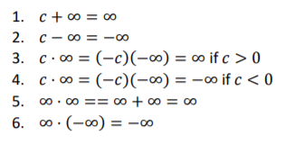

# Honors Math

## About

This is a summery of **Honors Calculus** (117 + 118) (or as some people call it: "**Abstract Calculus**")
This course will focus on set theory and number theory (and logic)

\* note this won't display properly on GitHub, I use a program called [Typora](https://typora.io/) with inline math enabled

## Index

0. [Shorthand](#0)

1. [Sets](#set)
2. [Logic](#logic)
3. [What is a number? (It's not what you think it is)](#number)
4. [Induction](#induction)
5. [Absolute values and Binomial Thm](#abs)
6. [Intervals and bounds](#inter)
7. [Real numbers](#real)
8. [Sequences and limits](#8)
9. [Functions (and notation)](#func)
10. [Continuity](#10)
11. 1-sided limits
12. Rolle's theorem
13. Intermediate value theorem (IVT)
14. Mean value theorem (MVT aka Meme value theorem)
15. Differentiation
16. First and second derivative test
17. L'Hopital's Rule (Le hospital)
18. Taylor's Theorem
19. Convex and concave
20. Inverse functions
21. Implicit differentiation
22. Exponentials and logs
23. Logarithmic differentiation
24. [Resources](#end)

## Notes

#### 0. Shorthand

Ex. $\to$ example

Thm $\to$ Theorem (will be in block quotes)

s.t. $\to$ such that

, or ; $\to$ such that, so (general connector depending on context)

wLOG $\to $ without loss of generality (i.e. similar to previous case, but I'm too lazy to do it)

seq. $\to$ sequence

##### Formal Logic

$\in \to$ element of

$\sub\ or\subseteq\ \to$ subset of

$\cup \to$ union

$\cap \to$ intercept

$\and \to$ and

$\or \to$ or

$\to\ \to$ then

$\iff \to$ if and only if (this is the same as \'\=\')

$=: \to$ is defined to be

$\forall \to$ for all

$\exist \to$ there exists

$\exist! \to$ there exists unique

$Q.E.D. \to$ and it is proved

$\therefore\ \to$ therefore 

$\because\ \to$ because

##### Fields

$\N \to$ natural numbers (i.e. 1,2,3,4...) [\* note 0 might be included in natural numbers depending on what text book is in use]

$W \to$ whole numbers ($\{0\} \cup \N$) 

$\Z \to$ integers (i.e. ..-2,-1,0,1,2...)

$\Q \to$ rational numbers (anything that can be expressed as $\frac{p}{q}, where\ p\in\Z\ and \ q\in\N$)

$\R \to$ will be discussed later

#### 1. Sets 

a set is defined as a number (can be 0 but then that would be the trivial or stupid set) of elements belonging to the same group

> Ex. 
>
> * {1,2,3} = {2,1,3}
> * {a,b}
> * {even, odd}
> * $\N$ = {1,2,3,4,5...}
> * {} (trivial set)

If an element 'x' is part of a set 'A', it is described as $x\in A$

If $A \cup B = A,\ B\sub A$. If for all elements of B are in A, then B is considered a subset of A

If elements of A are present in B, then those elements 'C' are said to be $A\cap B$ or $A\cap B=C$ 

From Bowmen notes

\* Most of the time, Russell's paradox will be introduced to scare any students still in the class. 

==Optional Exercise: look into Russell's paradox because it is quite interesting==

#### 2. Logic

##### Truth Values

There are 2 truth values, true (T or topology) and false (F or contradiction)

In math, there are established rules (which were set arbitrarily but is important for consistence around the world) for operations on truth values

Most of the time, a truth table will be used to illustrate how operators effect the truth value of a statement

Some common ones are:

$A\and B$ ; (A and B)

|      |      | A    | A    |
| ---- | ---- | ---- | ---- |
|      |      | T    | F    |
| B    | T    | T    | F    |
| B    | F    | F    | F    |

$A\or B$  ; (A or B)

|      |      | A    | A    |
| ---- | ---- | ---- | ---- |
|      |      | T    | F    |
| B    | T    | T    | T    |
| B    | F    | T    | F    |

$A\to B$  ; (If A then B)

|      |      | A    | A    |
| ---- | ---- | ---- | ---- |
|      |      | T    | F    |
| B    | T    | T    | T    |
| B    | F    | F    | T    |

$A\iff B$  ; (A if and only if B or A = B)

\* note this is a different way for displaying the truth table (important for chain multiple operators with more than 2 variables)

| A    | B    | $A\iff\ B$ | $A\to B\ and\ B\to A$ |
| ---- | ---- | ---------- | --------------------- |
| T    | T    | T          | T                     |
| T    | F    | F          | F                     |
| F    | T    | F          | F                     |
| F    | F    | T          | T                     |

To chain multiple operators together, you can use an extended truth table that considers all the variables (like the one above, but you must consider all variables and all the cases possible use a )

As seen from the table above, an iff is logically equivalent to a if b and b if a, therefore for proving an iff, the easiest way is to prove it using the A premise to get to B and then using the B premise to derive A

##### Contraction

The easiest way to prove something is to use *proof by contradiction*. Assume the opposite of the theorem or a fact that is true and find a contraction in reasoning

> Ex. 
>
> $\sqrt{2}\ is\ not\ rational$
>
> Start of proof by contraction:
>
> ​	Suppose for contradiction, $\sqrt{2}\ is\ rational$, i.e. it can be expressed as $\frac{p}{q}, where\ p\in\Z\ and \ q\in\N$. 
> $$
> \sqrt{2} = \frac{p}{q}\\
> \to \sqrt{2}^2 = \frac{p^2}{q^2}\\
> 2q^2=p^2
> $$
> \* note even number are expressed as 2n and odd number can be expressed as 2n+1 for $n\in\Z$
>
> Therefore p must be even because only an even squared is even $((2n)^2=4n^2\ and\ (2n+1)^2 = 4n^2+2n+1\therefore odd)$ 

#### 3. What is a number? (Algebraic Properties)

For real numbers, the following must be true

\* assume $a,b,c \in \R$ 

1. Must be associative

> $a+(b+c)=(a+b)+c$

2. Must have an additive identity

> $a+0=0+a=a$

3. Must have an *additive inverse* -a s.t. 

> $a+-a=-a+a=0$

4. Follows additive commutativity

> $a+b=b+a$

5. Are associate

> $a(bc)=(ab)c$

6. There exists are multiplicative identity where it is not 0

> $a\times 1= a$

7. It can distribute

> $a\times (b+c)=a\times b+a\times c$

8. Has an inverse that is not 0, i.e. $a^{-1}\ne 0$

> $a\times a^{-1}=1$

9. Follows multiplicative commutativity

> $a\times b=b\times a$

10. Trichotomy Law

> must be one and only one of the following relations:
>
> $a<b,\ a=b,\ a>b$

11. Closed under addition

> $a>0\ and \ b>0\to a+b>0$

12. Closed under multiplication

> $a>0\ and \ b>0\to a\times b>0$

More rules to come

Also note the first lemma (lemma is like a theorem but arbitrary defined to be a small theorem)

\* lemmas or thm can be assumed

#### 4. Induction

Steps

1. Prove for any element in set (usually 1 or 0 if they are in the set)
2. Suppose true for n
3. Prove for n+1

==Notice==: This makes it so it holds true for the first tested element and for every subsequent element (like a domino effect)

> Ex. 
>
> Gauss’ claim:
> $$
> 1+2+...+n\equiv\sum_{i=1}^ni=\frac{n(n+1)}{2}\\
> Let\ S\ be \ set\ n
> \\ Step\ 1:\ Check\ 1\in S\\
> 1=\frac{1(1+1)}{2}=1\\
> Step \ 2: \ Suppose \ k \in S\\
> \therefore \sum_{i=1}^ni=\frac{k(k+1)}{2}
> \\Then\ prove\ k+1\\\sum_{i=1}^{k+1}i=\frac{k(k+1)}{2}=1+2+3+...+k+(k+1)\\
> = \frac{k(k+1)}{2}+(k+1)\\
> =(k+1)(\frac{k}{2}+1)\\
> =\frac{(k+1)((k+1)+1)}{2}
> $$
> Hence $k+1\in S$ or $k\in S \to k+1\in S$
>
> \* see Bowmen notes (starting from page 19) for more examples

#### 5. Absolute Values and Binomial Thm

Absolute value is defined to be the following:

$$|x|=\left\{
        \begin{array}{ll} x & \quad x > 0\\
            -x & \quad x \leq 0
        \end{array}
    \right.$$

Properties of absolute values:

A1. $|x|\ge0$

A2. $|x|= 0\iff x=0$

A3. $|x|=|-x|$

A4. $|xy|=|x||y|$

A5. $If c\ge0,\ then\\|x|\le c\iff-c\le x\le x$

A6. $-|x|\le x\le |x|$

A7. $||x|-|y||\le |x\pm y|\le|x|+|y|$ by triangle inequality

##### Binomials

$n!=1\times2\times...\times(n-1)\times n$ if $n\in\N

$0!=1$

and

$\binom{n}{k}=\frac{n!}{k!(n-k)!}=\frac{n(n-1)...(n-k+1)}{1\times2\times...\times k }$ \* note equal to 1 if k=0

Helpful Thm:

* $\binom{n}{k}=\binom{n}{n-k}$
* $\binom{n}{0}=\binom{n}{n}=1$
* $\binom{n}{1}=\binom{n}{n-1}=n$
* $\binom{n}{k-1}+\binom{n}{k}=\binom{n+1}{k}$
* $\sum^{n}_{k=0}\binom{n}{k}=2^n,\ \forall n\in W$ (can be proved via induction as exercise)

**Binomial Thm**:

$(a+b)^n=\sum^n_{k=0}\binom{n}{k}a^{n-k}b^k$ (can also be proved by induction, see Bowmen notes page 26)

#### 6. Intervals and bounds

**Open and closed intervals are defined as the following**
$$
For \ a,b\in\R\ and \ a<b \\
 [a,b]=\{x:a\le x\le b\}, \to closed\\
 (a,b)=\{x:a< x< b\}, \to  open\\
 [a,b)=\{x:a\le x< b\}, \to relatively\ open\\
 (a,b]=\{x:a< x\le b\}, \to relatively\ open\\
$$
**not finite intervals**
$$
(-\infin , \infin) =\R
\\ [a,\infin)=\{x:x\ge a\}
\\ (-\infin, a)=\{x: x

#### 7. Real numbers

A real number is only defined if it satisfies all the rules laid out in [chapter 3](#number) and it follows the completeness axiom.

**Completeness Axiom:**

For every non-trivial subset of $\R$ with an upper bound has a lease upper bound in $\R$, (i.e. the $\sup$ exists in $\R$)

> * $\{\frac{p}{q}:p^2\le 2p^2, p\in \Z , q\in \N \}$
> * [0, 1] as sup at 1
> * [0,1) has sup at 1

> Lemma - Archimedean Property:
>
> No real number is an upper bound for $\N$
>
> Notes: $\N\sub\ \R$ (can be proved inductively)

#### 8. Sequences and limits

A sequence of real numbers is a function (see chapter below) s.t. $a:\N \to \R$. Usually a sequence is written as $a_n$ instead of $a(n)$. Sometimes a sequence can start at $k, s.t.\ k\in \Z, instead\ of \ k\in\N$.

A sequence is improper if $\exists\ k\in a_n\ if\ k \ is\ \pm \infin $

\* also note an extended real number system is $\overline{\R}=\R \cup \{-\infin, \infin\}$

**Rules on extended real number system **:

==**Limits**== (This is mega important)

$a_n$ is a sequence. The limit of the sequence ($a_n $) is L, s.t.  $L\in \R$ and $\lim_{n\to \infin}a_n=L$ if for every $\epsilon > 0, \exists\ N\in\N, s.t. |a_n-L|<\epsilon, \forall\ n>N$

Translation to English: The limit of the sequence as the index approaches infinity exists, if there exists an error ($\epsilon$ = epsilon that is greater than 0) small enough the element in sequence at index very very large (approaches $\infin$) minus the defined limit is less than that error.  [Think of an error bar of value $\epsilon$ and $|a_n-L|$ being within the error bar if limit exists]

If that limit exists, it is convergent, otherwise, it is divergent (improper limit of the sequence)

If $\lim_{n\to \infin }a_n =\infin,$ if $\forall$ M>0, there is $N\in \N $ s.t. $a_n >M\ \forall\ n>N$ (wLOG for $-\infin$) 

**Properties of limits**

Let $a_n, b_n$ be sequences with limit L and M

1. If $c,d\in \R, and\ cL,dM$ are both finite of opposing signs, then $ca_n +db_n \to cL+dM$
2. If LM is not undefined, 0 $x\pm\infin, a_b b_n \to LM$
3. If $M\ne 0,$ and both M, N are finite, then $\frac{a_n}{b_n}\to\frac{L}{M}$ (only for n large enough)
4. If $L=\pm \infin$, then $\frac{1}{a_n}\to 0$ (only for n large enough)

\* look at page 36 of Bowmen notes to see proofs

> Lemma
>
> If $a_n \le b_n\ \forall\ n\ and \ a_n\to L,b_n\to M. \to \ L\le M$
>
> Squeeze thm (or sandwich thm if and only if you are hungry)
>
> If $a_n, c_n \to L\ and \ a_n\le b_n\le c_n \forall n. \to b_n \to L$
>
> A sequence is bounded if $\exists M\in \R, s.t. |a_n|\le M\ \forall\ n$
>
> Helpful example:
>
> ​	$|sin(x)|\le 1$
>
> Why? Homework question

Now what max and min functions are (they are self explanatory, otherwise, look it up in the [python docs](https://www.geeksforgeeks.org/max-min-python/))

> Thm:
>
> Convergent sequence implies bounded but not the other way
>
> (convergent $\to$ bounded)
>
> (bounded $\not \to$ convergent)

##### Monotone

A sequence is increasing if for $a_n$,
$$
a_1\le a_2\le\ ..., i.e. \ a_n\le a_{n+1}\ \forall n\in \N
$$
A sequence is strictly increasing if for $a_n$,
$$
a_1< a_2<\ ..., i.e. \ a_n<a_{n+1}\ \forall n\in \N
$$
\* likewise for decreasing

A sequence if **monotone** if it is either an increasing or a decreasing sequence (or both)

In monotone sequences, $convergent \iff bounded$

**Subsequences**

Given a seq. $\lim_{n\to\infin}a_n $ and a strictly increasing sequence of natural numbers  $\lim_{n\to\infin}n_k$, we can form subsequence  $\lim_{n\to \infin } $  $a_{n_k}$ of $\lim_{n\to\infin}a_n $

> Ex.
>
>  $\lim_{n\to\infin}(2k-1)^2=\{1,9,25...\}$ is a subsequence of  $\lim_{n\to\infin}n^2=\{1,4,9,16,...\}$
>
> Thm. 
>
> convergent $\iff$ all subsequence convergent
>
> Lemma:
>
> a) $0\le c<1 \to c^n \le c\le 1$
>
> b) $c > 1 \to c^n \ge c > 1$
>
> 
>
> $\forall n\in \N$
>
> c) $0\le c<1 \to c\le c^{1/n}<1$
>
> d) $c>1>1 \to c\ge c^{1/n}>1$
>
> **Ratio test for seq**
>
> $\lim_{n\to \infin} |\frac{a_{n+1}}{a_n}|=r\ where\ r\in[0,1)\ means\ that\ a_n \ is\ bounded\ and \to0$

**Bolzano-Weierstrass Thm:**

A bounded sequence has a convergent subsequence (see page 49 for proof)

**Cauchy Criterion**

 A sequence $a_n$ is a Cauchy sequence (or just Cauchy) if $\forall \epsilon>0\ \exist \ N\ s.t.\\ m,n >N \to |a_m-a_n|<\epsilon$

$\therefore\ a_n$ is convergent $\iff a_n$ is Cauchy

#### 9. Functions

A function $f:X\to Y$ is a rule that assigns each $x \in X $ to element $F(x) \in Y$. 

The set of all X is called the domain of f, while the Y is called the codomain

The range or image of f is the set $f(X) = \{f(x)|x\in X\}$

\* think of a rule as a machine that takes X and through a defined process turns that X or all X to Y

==Note:== 

$f: \R_{\ge0}\to \R $ defined by f(x)$=x^2$ is different from$g:\R\to\R$ also defined by $x\mapsto x^2$ (Note $\mapsto$ is maps to and is used more often in linear algebra)

**Trigonometry**

> opp = opposite
>
> hyp = hypotonus 
>
> adj = adjacent
> $$
> sinx=\frac{opp}{hyp}\\
> cosx=\frac{adj}{hyp}\\
> tanx=\frac{opp}{adj}=\frac{sinx}{cosx}\\
> 
> \\
> cscx=\frac{1}{sinx}\\
> \sec x=\frac{1}{cosx}\\
> cotx=\frac{1}{tanx}\\
> \\
> Pythagoras'\ Theorem
> \\ opp^2+adj^2=hyp^2\\
> \to sin^2x+cos^2x=1
> \\1+cot^2x=csc^2x\\tan^2x+1=sec^2x
> \\Also,\ |sinx|\le1\ \&\ |cosx|\le1
> $$
> This can be demonstrated with a unit circle
>
> \* Note, degrees will not be used, use radians
>
> $\pi$ radians = $180^o$
>
> 
>
> $cos θ = sin (\frac{\pi }{2} − θ ) ,$
>
> $sinθ= cos(\frac{\pi }{2} − θ ) ,$
> $$
> Supplementary \ Angle \ Identities:\\
> sin(\pi-x)=sinx\\
> cos(\pi-x)=-cosx\\
> Symmetries:\\
> sin(-x)=-sinx
> \\cos(-x)=cosx
> \\sin(x+2\pi)=sinx\\
> cos(x+2\pi)=cosx
> $$
> Special values:
> $$
> sin0=cos(\frac{\pi}{2})=0\\
> sin(\pi/2)=cos0=1
> \\sin(\pi/4)=cos(\pi/4)=1/\sqrt{2}\\
> sinx(\pi/6)=cos(\pi/3)=1/2\\
> sin(\pi/3)=cos(\pi/6)=\sqrt{3}/2
> \\ cos(A-B)=cosAcosB+sinAsinB\\
> $$
> Double Angle Formulas:
> $$
> sin2A=2sinAcosA\\
> cos2A=2cos^2A-1=1-2sin^2A\\
> tan2A=\frac{2tanA}{1-tan^2A}\\
> sinx\le x\le tanx\ \forall x\in [0, \pi/2)\\
> Also:\\
> |sinx|\le |x| \ \forall x\in\R
> $$
> 

Let I be interval s.t. $x_o$ is an accumulation point of f (see misc. notes below) (i.e. $x_o \in I\ or\ x_o \in \delta I$)

For any function with domain I, we say the real number $\infin$ is the limit of f as x approaches $x_o$

$\lim_{x\to x_o}f(x)=\infin $ if for every M>0, there is $\delta>0$ s.t. $\forall x\ne x_o \in I\ with\ |x-x_o|<\delta, f(x) > M$, likewise for $-\infin$

> Thm. Equivalence of Function and Sequence Limits:
>
> $\lim_{x\to a }f(x)=L \iff f$ is defined near a and every sequence point in $x_n$ in the domain of f with $x_n\ne a$, but $\lim_{n\to \infin} x_n = a$, satisfies $\lim_{n\to \infin} f(x_n )= L$
>
> \* See page 68 for proof
>
> Corollary:
>
> Assume $\lim_{x\to a }f(x)=L$ and $\lim_{x\to a }g(x)=M$
>
> 1. $\lim_{x\to a }(f(x)+g(x))=L+M$
> 2. $\lim_{x\to a }f(x)g(x)=LM$
> 3. $\lim_{x\to a }\frac{f(x)}{g(x)}=\frac{L}{M}$ if $M\ne0$
>
> **Cauchy Criterion for Function**
>
> $\lim_{x\to a }f(x)$ exists $\iff$ for every $\epsilon >0, \exist \delta >0$ s.t. x, y $\in (a-\delta,a)\cup(a,a+\delta), $ their function values satisfy $|f(x)-f(y)|<\epsilon$

#### 10. Continuity:

[**⬆ Back to top**](#top)

## Misc. Notes:

Useful def:

$\N \setminus \{3\} = \{1,2,4,5,...\}$

## Resources

* school notes
* [Bowmen notes](http://www.math.ualberta.ca/~bowman/m117/m117.pdf)

### Note about this course and my experience

----

My school had an extraordinary honors calculus year. The main prof left by second semester and a German prof can in to sub, but, because of his Germanicness (he literally goes off of a German textbook), it was difficult to follow his sometimes rigorous and sometimes not rigorous (he called them trivial) proofs. 

Also, at my university, compute 272 is trivially similar to 117. 

## Licence

The rules for copy and distributing this project licence are 
outlined in the licence.txt file.

This project is under an MIT licence 

## Thanks

Dedicated to Dr. Terry Gannon who definitely did not abandon the class

## Contributions

Contribute if and only if you know what you are doing (and optionally, it would help if you where Germanic or fluent in Germanics)

\* If someone wants to convert this to Latex, go ahead and pull request (must have a index or contents page with links). I tried with pandoc, but it was not as complete as I thought so if anyone wants to do clean up, go ahead, also I can just export as pdf

